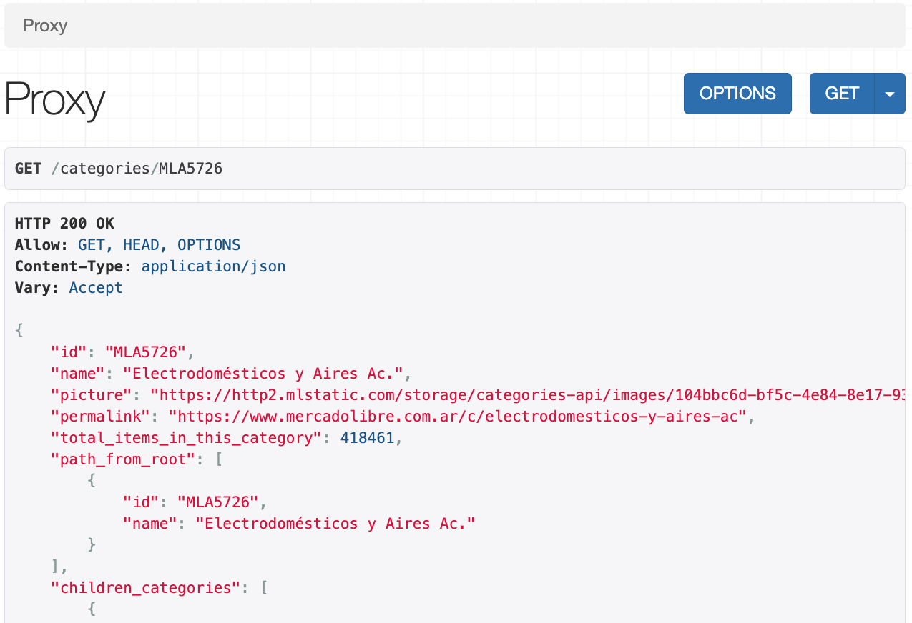
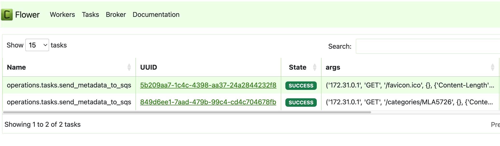
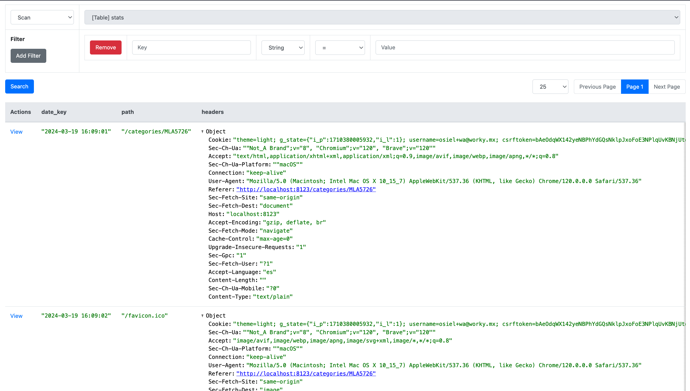
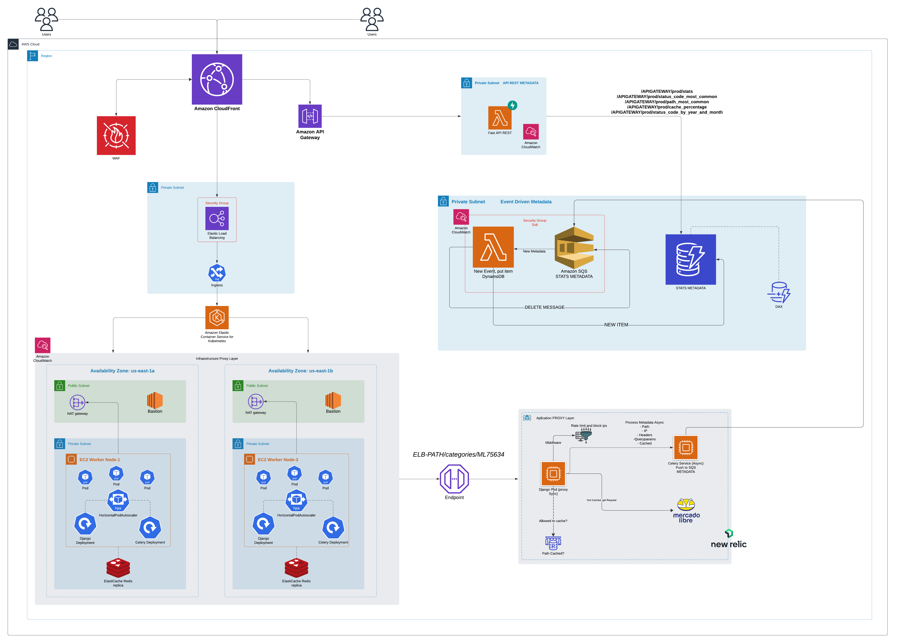

<br />
<div align="center">
  <a href="images/mercado-libre-log.jpg">
    
  </a>

  <h3 align="center">Mercado Libre Challenge - Osiel Torres</h3>

</div>


# 🚧 About The Project

Mercadolibre hoy en día correr sus aplicaciones en más de 20000 servidores, estos suelen comunicarse entre sí a través de apis, algunas accesibles desde el exterior (api.mercadolibre.com).
Uno de los problemas que tenemos actualmente es como controlar y medir estas interconexiones. Para esto necesitamos crear e implementar un "proxy de apis" (codear).
Este proxy debe poder cumplir al menos con los siguientes requisitos (en orden de importancia):

● Permitir ejecutar la función de proxy, sobre el dominio api.mercadolibre.com, es decir que al ejecutar un llamado al proxy este debera retornar el llamado a api.mercadolibre.com
Ejemplo "curl 127.0.0.1:8080/categories/MLA97994" debera retornar el contenido de https://api.mercadolibre.com/categories/MLA97994

● Se deberá poder controlar la cantidad máxima de llamados por

    ○ ip de origen
    ○ path de destino
    ○ Combinaciones de ambos
    ○ Otros criterios u alternativas de control son bien vistas ;)
● Estadísticas de uso: se deben almacenar (y en lo posible visualizar) estadísticas de uso del proxy

● El proxy debe correr sobre Linux

● El código debe estar en un repo git para poder pegarle un vistazo y discutir

● La carga media del proxy (como solución) debe poder superar los 50000 request/segundo. Por lo cual como escala la solución es muy importante

Algunos deseables:
- La interfaz para estadísticas y control podría soportar rest
- Tener todos los puntos completos (y funcionando), aunque cualquier nivel de completitud es aceptable
- Tener algún dibujo, diagrama u otros sobre como es el diseño, funcionamiento y escalabilidad del sistema suma mucho
- Funcionar contra el api de mercadolibre real, estaría buenísimo, de todas formas son conocidos algunos errores con HTTP’s, por lo que cualquier otra alternativa (mocks, otra api, etc) que pruebe el funcionamiento también es válido

---
## ⚠️ Suggestion: Read first "Motivation to create" Section
### Built With

<p>
  &nbsp;
    &nbsp;
</p>

---


<!-- GETTING STARTED -->
# ⚡️ Development environment explain

Containers in order docker-compose.yaml file:

### Services Overview:

#### 1. **dynamodb-local**:
   - **Description**: This service provides a local instance of DynamoDB for testing purposes.
   - **Usage**: Utilize this service to interact with a local instance of DynamoDB during development and testing.
   - **Ports**: Exposes port 8000 for accessing the local DynamoDB instance.

#### 2. **redis**:
   - **Description**: Redis service used as a message broker and cache.
   - **Usage**: Provides caching and message broker functionalities for various services.
   - **Ports**: Exposes port 6380 for connecting to Redis.

#### 3. **django**:
   - **Description**: Django container serving as the main application for proxy sync service.
   - **Usage**: Runs the Django application handling proxy synchronization tasks.
   - **Dependencies**: Depends on `dynamodb-local`, `localstack`, and `redis`.
   - **Ports**: Exposes port 8123 for accessing the Django application.

#### 4. **celery**:
   - **Description**: Celery container responsible for executing asynchronous tasks.
   - **Usage**: Executes background tasks asynchronously using Celery.
   - **Dependencies**: Depends on `redis`.
   
#### 5. **flower**:
   - **Description**: Container providing a web-based tool for monitoring and debugging Celery tasks.
   - **Usage**: Monitor and debug Celery tasks visually through Flower's web interface.
   - **Dependencies**: Depends on `redis` and `celery`.
   - **Ports**: Exposes port 5555 for accessing the Flower web interface.

#### 6. **localstack**:
   - **Description**: LocalStack service simulating various AWS resources.
   - **Usage**: Mimics AWS services locally for development and testing purposes.
   - **Supported Services**: SQS, IAM, S3, Lambda, and lambda subs
   - **Ports**: Exposes port 4566 for accessing LocalStack services.

#### 7. **init-service**:
   - **Description**: Service for initializing resources in LocalStack.
   - **Usage**: Initializes resources such as Lambda functions, SQS queues, and DynamoDB tables in LocalStack.
   - **Dependencies**: Depends on `localstack`.

#### 8. **fastapi**:
   - **Description**: FastAPI container providing a RESTful API to retrieve metadata stats.
   - **Usage**: Access metadata statistics through the FastAPI RESTful API.
   - **Dependencies**: Depends on `dynamodb-local`.
   - **Ports**: Exposes port 9000 for accessing the FastAPI endpoints.

#### 9. **dynamodb-admin**:
   - **Description**: Container for visualizing DynamoDB tables through a web-based UI.
   - **Usage**: View and interact with DynamoDB tables through the admin UI.
   - **Dependencies**: Depends on `dynamodb-local`.
   - **Ports**: Exposes port 8001 for accessing the DynamoDB Admin UI.

#### 10. **master**:
   - **Description**: Master service for Locust used for load testing.
   - **Usage**: Orchestrates and controls Locust load testing scenarios.
   - **Ports**: Exposes port 8089 for accessing the Locust master.

#### 11. **worker**:
   - **Description**: Worker service for Locust used for load testing.
   - **Usage**: Executes load testing scenarios defined by the master Locust service.
   - **Dependencies**: Depends on the master Locust service.


----

# Project structure


  ```sh
├── README.md
├── api_stats           ------>     Fast Api APP serverless
│   ├── Dockerfile
│   ├── __init__.py
│   ├── lambda.py
│   └── requirements.txt
├── docker-compose.yaml
├── kubernetes            ------>     K8s manifests
│   └── deployment.yaml
├── lambda_consumer         ------>    Consumer lambda SQS 
│   ├── Dockerfile
│   ├── __init__.py
│   ├── lambda.py
│   └── requirements.txt
├── locust               ------>     Load testing directory app
│   ├── Dockerfile
│   ├── __init__.py
│   ├── entrypoint.sh
│   └── locustfile.py
├── locustfile.py
├── metrics-infra-cloudformation.yaml   ------>    Cloudformation template
├── proxy_app                 ------>     Proxy Core app
│   ├── Dockerfile
│   ├── Pipfile
│   ├── Pipfile.lock
│   ├── manage.py
│   ├── monitoring
│   │   ├── __init__.py
│   │   ├── apps.py
│   │   ├── migrations
│   │   │   └── __init__.py
│   │   ├── urls.py
│   │   └── views.py
│   ├── operations
│   │   ├── __init__.py
│   │   └── tasks.py
│   ├── proxy                  ------>     Core proxy code
│   │   ├── __init__.py
│   │   ├── asgi.py
│   │   ├── celery.py
│   │   ├── settings.py
│   │   ├── urls.py
│   │   └── wsgi.py
│   ├── proxy_pass
│   │   ├── __init__.py
│   │   ├── apps.py
│   │   ├── services.py
│   │   └── views.py
│   ├── pytest.ini
│   └── tests
│       ├── __init__.py
│       ├── test_services.py
│       └── test_views.py
└── setup                     ------>     Setup AWS localstack
    ├── Dockerfile
    ├── __init__.py
    └── entrypoint.sh

  ```
----

#  🔨 Getting Started

Start the project


  ```sh
  docker-compose up --build
  ```

It's important to wait for the init-service to complete in order to have the following:

- SQS Queue created
- Lambda consumer created
- Lambda consumer subscribed to the SQS queue
- DynamoDB table created
- You will receive the message: All resources initialized! 🚀

To run tests once you have the services started, you can execute the following command

  ```sh
  docker-compose exec -e DJANGO_CONFIGURATION=Testing django pipenv run pytest
  ```

# 🥷🏽 Usage Development environment


### 🚥 Proxy core application

Once you have the services up and running, the use of the proxy is as follows:


Proxy URL : http://localhost:8123/
Path category: categories/MLA5726 


  ```sh
❯ curl http://localhost:8123/categories/MLA5726
 ```


If you request this URL again, it will be responded through the Redis cache.


### 🎰 Fast Api metrics in house (product - lambda)

To visualize all metadata statistics of requests (application level).

  ```sh
❯ curl -X POST "http://localhost:9000/2015-03-31/functions/function/invocations" \
-H "Content-Type: application/json" \
-d '{"resource": "/stats", "path": "/stats", "httpMethod": "GET", "requestContext": {}, "multiValueQueryStringParameters": null}'
 ```


To visualize most common path metric (application level).

  ```sh
❯ curl -X POST "http://localhost:9000/2015-03-31/functions/function/invocations" \
-H "Content-Type: application/json" \
-d '{"resource": "/path_most_common", "path": "/path_most_common", "httpMethod": "GET", "requestContext": {}, "multiValueQueryStringParameters": null}'
 ```

To get cache percentage of all metrics (application level).

  ```sh
❯ curl -X POST "http://localhost:9000/2015-03-31/functions/function/invocations" \
-H "Content-Type: application/json" \
-d '{"resource": "/cache_percentage", "path": "/cache_percentage", "httpMethod": "GET", "requestContext": {}, "multiValueQueryStringParameters": null}'
 ```


To get cache percentage of all metrics (application level).

  ```sh
❯ curl -X POST "http://localhost:9000/2015-03-31/functions/function/invocations" \
-H "Content-Type: application/json" \
-d '{"resource": "/cache_percentage", "path": "/cache_percentage", "httpMethod": "GET", "requestContext": {}, "multiValueQueryStringParameters": null}'
 ```


All status code response filtered by year and month (application level).

  ```sh
❯ curl -X POST "http://localhost:9000/2015-03-31/functions/function/invocations" \
-H "Content-Type: application/json" \
-d '{
    "resource": "/status_code_by_year_and_month",
    "path": "/status_code_by_year_and_month",
    "httpMethod": "GET",
    "requestContext": {},
    "multiValueQueryStringParameters": {
        "year": [
            "2024"
        ],
        "month": [
            "03"
        ]
    },
    "Content-Type": "application/json"
}'
 ```


### 🍀 Celery flower

To visualize asynchronous tasks. http://localhost:5555/tasks




### 🛢️ DynamoDB admin

To visualize metadata dynamodb http://localhost:8001



# 💣 Load Testing

For load testing, we will use Locust, which will allow us to simulate requests 
and a number of concurrent users in our application. To do this, we must go to...

http://localhost:8089


https://github.com/osstorres/meli/assets/36452775/cc47b317-204b-472f-b22e-ecc2caf1f3c9


---

# 🤔 How does it work 

Django Rest Framework allows us to create routes quickly and easily for our services. At the moment, we are allowing any route to our proxy to be processed by our MercadoLibre service.

Within proxy_app/proxy_pass/views.py, we can find the endpoint we're exposing to access our proxy service, which contains the following code:


```bash
from rest_framework.views import APIView
from rest_framework.response import Response
from .services import CacheService, MercadoLibreAPIService
import requests
from django.utils.decorators import method_decorator
from django_ratelimit.decorators import ratelimit
from django.conf import settings


@method_decorator(
    ratelimit(key="ip", rate="5/m", method=["POST"], block=True), name="post"
)
@method_decorator(
    ratelimit(key="ip", rate="50000/s", method="GET", block=True), name="get"
)
class ProxyView(APIView):
    def get(self, request, *args, **kwargs):
        path = request.path
        params = request.query_params
        cache_key = f"{path}"

        # Attempt to retrieve data from cache
        cached_data = CacheService.get_from_cache(cache_key)
        if cached_data:
            MercadoLibreAPIService.process_metadata(request, True, 200)
            return Response(cached_data)

        # Fetch data from MercadoLibre API
        try:
            data, status = MercadoLibreAPIService.get_data(path, params)
            MercadoLibreAPIService.process_metadata(request, False, status)
            CacheService.store_in_cache(cache_key, data)
            return Response(data)
        except requests.RequestException as e:
            status = e.status_code if hasattr(e, "status_code") else 400
            MercadoLibreAPIService.process_metadata(request, False, status)
            return Response({"error": str(e)}, status=status)

    def post(self, request, *args, **kwargs):
        # Testing rate limit post method by ip:)
        return Response("OK", status=201)


```

Our view is solely responsible for processing the request to our MercadoLibreAPIService, 
where the application logic resides. Additionally, we have a CacheService that manages the cache. If our request is already cached, we simply process the response back to the user.

If the request is not cached, we request it through MercadoLibreAPIService.process_metadata.


#### 👮‍ Rate limits and block ip

*important: our architecture is associated with a Redis cache, we can leverage it for persisting the rate limits in our EKS cluster.*

An important point to highlight is the use of django_rate_limit. For testing purposes,}
we've created a POST method limited to 5 requests per minute for each IP address. 
Additionally, we have set a high rate limit for our marketplace proxy at 50,000 requests per second. 
This setup allows us to combine IP-based blocking for a specific method within a defined time frame for requests.

Given that our proxy doesn't pass through an authentication system, we can only implement IP-based
restrictions. However, in the case of an application with authentication, we can make use of user_or_ip

```bash
@ratelimit(key='user_or_ip', rate='10/s')
@ratelimit(key='user_or_ip', rate='100/m')
```

Django rate limit does not provide us with a mechanism to block specific IP addresses.
That's why we've developed middleware that allows us to filter the request IP against a blacklist
to determine whether to allow it through to the proxy or not. The code can be found in  proxy_app/proxy_pass/middleware_block_ip.py


```bash

class BlockIPMiddleware:
    def __init__(self, get_response):
        self.get_response = get_response

    def __call__(self, request):
        ip_address = request.META.get("REMOTE_ADDR")
        logger.info(f"== Meta remote addr {ip_address} ==")
        if ip_address in settings.BLOCKED_IPS:
            response = HttpResponseForbidden("Raise middleware IP block.")
            response.status_code = 403
            return response
        return self.get_response(request)
```


The blacklist can be configured within proxy/settings.py in the environment 
variable BLOCKED_IPS = os.getenv("BLOCKED_IPS"), where BLOCKED_IPS is a list of blocked IP addresses


```bash
class MercadoLibreAPIService:
    BASE_URL = "https://api.mercadolibre.com"

    @classmethod
    def get_data(cls, path: str, params: Dict[str, str]) -> Dict:
        """
        Make a GET request to the MercadoLibre API.
        """
        url = f"{cls.BASE_URL}{path}"
        response = requests.get(url, params=params)
        response.raise_for_status()  # Raise exception if request fails
        return response.json()

    @classmethod
    def process_metadata(cls, request, cached: bool, status_code: int):
        send_metadata_to_sqs.delay(
            request.META.get("REMOTE_ADDR"),
            request.method,
            request.path,
            dict(request.query_params),
            dict(request.headers),
            cached,
            status_code,
        )
```


### ⚓ Cache service (Elasticache Redis)


```bash

class CacheService:
    @staticmethod
    def get_from_cache(cache_key: str) -> Any | None:
        """
        Retrieve data from cache.
        """
        if cached_data := cache.get(cache_key):
            logger.info(f"=== RESPONSE CACHED {cache_key}")
            return json.loads(cached_data)
        return None

    @staticmethod
    def store_in_cache(cache_key: str, data: Dict, expiration_time: int = 3600):
        """
        Store data in cache.
        """
        allowed_cache = any(
            word in settings.CACHED_PATHS for word in cache_key.split("/")
        )
        logger.info(f"=== CACHE ALLOWED {allowed_cache} - key {cache_key}")
        if allowed_cache:
            cache.set(cache_key, json.dumps(data), expiration_time)
            logger.info(f"=== CACHED RESPONSE {cache_key}")

```


The service that manages the cache for responses to the Mercado Libre API has 
associated rules for storing this information. Firstly, we have permitted paths for caching.
If the request's path is not associated with any of our permitted paths in the environment variable,
it won't be processed for caching. On the other hand, if it is found in the CACHED_PATHS environment variable,
it will be cached.

---
# 📖 Motivation to create

#### * Decision making: https://aws.amazon.com/es/architecture/well-architected/

Why did I choose this architecture?

We can summarize some important requirements to start designing the architecture:

- Generate an "API proxy" (proxy.com/categories/ ---> mercadolibre.com/categories/)
- Blocking IPs and paths to the proxy
- Visualize proxy usage statistics, if possible, expose a REST API
- Support scalability of 50k requests per second 

First, we must consider that we will have a large number of requests to our proxy that we must support at the server level. It is not mentioned if there 
will be times of the day with more traffic, 
so we can start thinking about vertical and horizontal auto-scaling of our services. Additionally, an important requirement is 
to be able to block IPs and paths to our services. Based on this, we can take two paths:
Firstly, implementing a WAF before accessing our services and processing the request, AWS WAF helps us have complex denial rules for a group of IPs, with IP sets, 
path blocking, and a combination of these towards the resources we expose, in this case, our EKS proxy service.

Additionally, this requirement was also implemented at the application level, as explained in the "How does it work? rate limits" section,
where we block certain IPs through middleware and specific paths as well as methods of the URLs within a defined time frame, such as seconds or minutes.

With these ideas in mind, the "simple" path with a basic architecture could be an EC2 instance with an auto-scaling group that 
increases instances as traffic increases. Initially, this may yield results, but we may fall short 
when scaling more services or considering decoupling components for further data processing. Due to this, I chose Kubernetes to
self-manage some containers needed in the proxy. With Kubernetes, we can cover auto-scaling, redundancy, and operational excellence.


We need to consume an external API (mercadolibre.com), it's important to handle exceptions that are beyond our control and return
appropriate status codes. It's crucial to note that considering our
example request (https://api.mercadolibre.com/categories/MLA97994), we can identify that we will likely have repeated requests 
over time from different users. In this use case, we can implement a cache to avoid re-requesting information from Mercado Libre.
This way, we can provide much faster responses to our users, reduce third-party API failures, and scale the cache cluster for
reading instead of our servers in a Kubernetes cluster, which would be more costly.

However, we must also consider that not all responses should be cached. That's why we've defined a rule that allows us to save only the routes containing
"/categories" and "/site" within the URL. These cache rules can be modified through the environment variable explained in the "How does it work? cache service" section.

At this point, we have covered the following:

- Horizontal and vertical scalability
- Reliability
- Efficiency


Once our proxy service is ready, we move on to the requirement of usage statistics. For this requirement, I took two approaches: one 
regarding resource usage metrics (CPU, memory, latency, execution time, cluster health, etc.) and another regarding application metadata. 
Infrastructure usage metrics can be covered using CloudWatch, which integrates well with our services, and an external tool like New Relic or 
Prometheus-Grafana for our EKS cluster. For application metadata metrics, I decided to create an event-driven architecture to manage the information to process,
as described in the architecture diagram. Basically, our synchronous proxy responds as quickly as possible to the user, and we use Celery to handle asynchronous
tasks that process metadata from user requests, such as the IP source and requested path. This metadata is formatted and sent to an SQS queue that 
keeps the messages available for a subscribed Lambda function to use this information and integrate it into DynamoDB for consumption through a REST API.

*Important considerations*

- Reduce resource consumption in the deployment of Celery so that it only sends metadata to a queue and does not process it in DynamoDB.
- Cost reduction when inserting into DynamoDB; instead of inserting item by item, the Lambda function can process batches of messages and send them to
- DynamoDB with lower latency at a VPC endpoint directly in its own network.
- Having an event-driven architecture based on an SQS queue allows us more possibilities for operations with this information. For example, subscribing
- another Lambda function to send notifications in case of an unrecognized error state by our knowledge base in the external APIs indicating an 
- uncontrolled failure. Since these are metadata statistics, they don't need to be available at that moment for reading. This processing to DynamoDB
- can take its time. Important for the production and development environment: Currently, in this solution, messages are read one by one. Ideally,
- messages should be processed in batches, for example, 10k messages in each reading from the SQS queue in batch.


Once we have the application metadata available in DynamoDB, we will use a serverless architecture to serve a REST API based on FastAPI that exposes our
DynamoDB data through an API Gateway. 

*important 2: It's important to consider that this architecture is intended for demonstration purposes, and the volume of 
data we can ingest into our  DynamoDB can be very high. Therefore, we need to define rules to identify the information we 
want to store in DynamoDB to reduce costs in our services.*

One of the main motivations for exposing this data through FastAPI is to be able to extract important statistics for the business. see more in  *Fast Api metrics in house (product - lambda)*  section

[//]: # ()
[//]: # (# 🧪 First ideas)

[//]: # ()
[//]: # (![arch]&#40;images/arch1.png&#41;)

[//]: # ()
[//]: # ()
[//]: # (# 🧪 Shaping)

[//]: # ()
[//]: # (![arch2]&#40;images/arch2.png&#41;)

---

# 🏗️ Architecture️  




# ✨ Production Env ✨ -- WIP


### Proxy URL :

### Stats Metadata API: 

### Dashboards :

